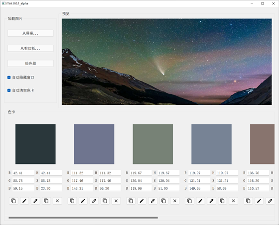
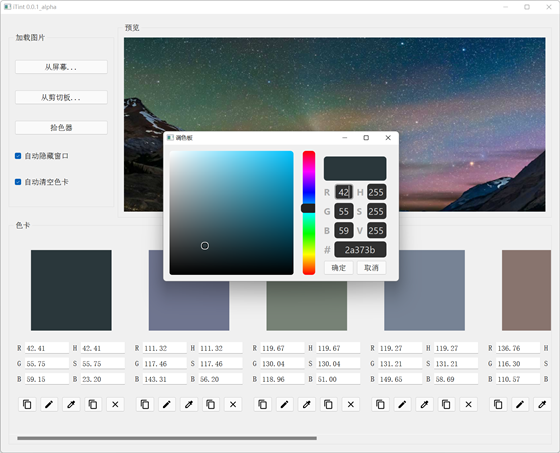
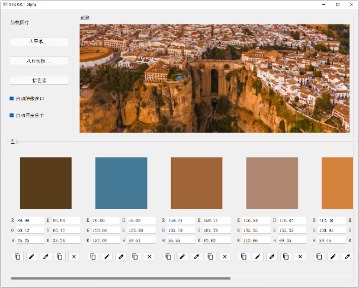
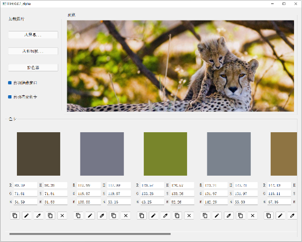

# iTint

A theme color extraction and screen color picker widget.

## 

## Features

- extraction theme color from file or screen (octree algorithm)
- directly add color to palette by color picker
- edit color in palette
- high-DPI support

## 

## TODO

- [ ] more theme color extraction algorithms
- [ ] the parameters of the algorithm can be modified


## How to (Users)

You can choose to download the executable EXE file and use it directly without preparing other dependencies (windows only) OR installing through PIP (cross-platform).

### Download executable EXE

1. Download from release page: https://github.com/ColorsWind/iTint/releases

2. Run `itint.exe`

### Install throught PIP

```bash
pip install iTint==0.0.1
```

once iTint is installed, you can run `itint` or `itint_console` to launch this application.

## How to (Developers)

Contributions are welcome.

### Requirement

```bash
pip install -r requirements.txt
```

- python >= 3.7
- numpy
- pillow
- pyside2

### Project sturctures

```
src/
└── itint
    ├── main.py            Entry of this application
    ├── pyside_compile.py  compilie UI files and QRC file
    ├── ui_*.ui            UI files
    ├── ui_*.py            Complied UI files
    ├── widget_*.py        Widget files
    ├── assets.qrc         QRC file
    ├── assets_rc.py       Complied QRC file
    ├── ...
    └── assets/            Icons
        └── *.svg
requirements.txt
LICENSE
THIRD_PARTY
README.md
```

To start this application, run `itint.py` .

To edit UI, you may use QT Creator or QT Designer to edit ui*_.ui, then run `pyside_compile.py` to recompile UI files.


## Screenshot

*The pictures for the test are from Bing wallpaper*









See more in `images`


## License

MIT License

**Copyright (c) 2022 ColorsWind**

Permission is hereby granted, free of charge, to any person obtaining a copy of this software and associated documentation files (the "Software"), to deal in the Software without restriction, including without limitation the rights to use, copy, modify, merge, publish, distribute, sublicense, and/or sell copies of the Software, and to permit persons to whom the Software is furnished to do so, subject to the following conditions:

The above copyright notice and this permission notice shall be included in all copies or substantial portions of the Software.

THE SOFTWARE IS PROVIDED "AS IS", WITHOUT WARRANTY OF ANY KIND, EXPRESS OR IMPLIED, INCLUDING BUT NOT LIMITED TO THE WARRANTIES OF MERCHANTABILITY, FITNESS FOR A PARTICULAR PURPOSE AND NONINFRINGEMENT. IN NO EVENT SHALL THE AUTHORS OR COPYRIGHT HOLDERS BE LIABLE FOR ANY CLAIM, DAMAGES OR OTHER LIABILITY, WHETHER IN AN ACTION OF CONTRACT, TORT OR OTHERWISE, ARISING FROM, OUT OF OR IN CONNECTION WITH THE SOFTWARE OR THE USE OR OTHER DEALINGS IN THE SOFTWARE.


 The license for the use of third-party resources is shown in `THIRD_PARTY`.
